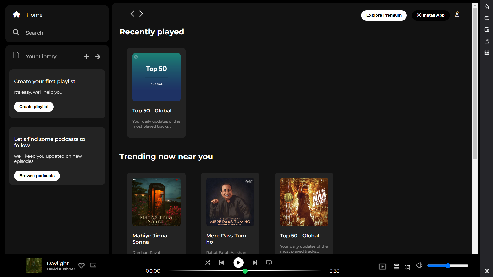

# 🎵 Spotify Clone  

A web-based **Spotify Clone** built with **HTML, CSS, and JavaScript**, featuring a music player, interactive UI, and responsive design.  

## 🚀 Live Demo  
[Click here to view the project](https://magenta-lolly-cb8823.netlify.app/) _(https://magenta-lolly-cb8823.netlify.app/)_  

## 📌 Features  
✅ Home and Search Navigation  
✅ Sidebar with "Your Library" Section  
✅ Playlist and Podcast Suggestions  
✅ Interactive Music Player with Playback Controls  
✅ Responsive Design  

## 📸 Screenshots  
_(Add relevant images here)_  
  

## 🛠️ Technologies Used  
- **HTML** - Structure of the web app  
- **CSS** - Styling and layout (including FontAwesome icons & Google Fonts)  
- **JavaScript (Optional)** - Enhancing interactivity  

## 📂 Project Structure  
Directory structure:
└── agarwalchetan-spotify-clone/
    ├── README.md
    ├── index.html
    ├── style.css
    ├── Spotify-clone/
    └── assets/

